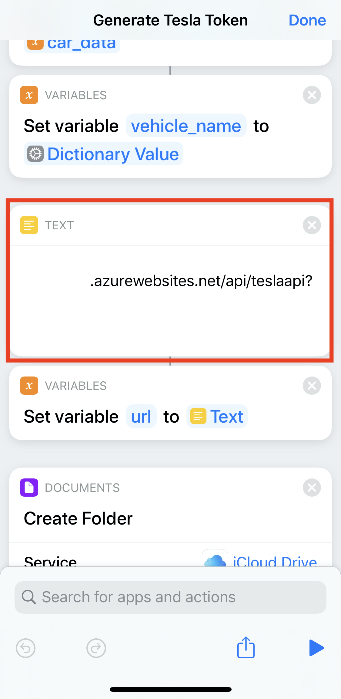
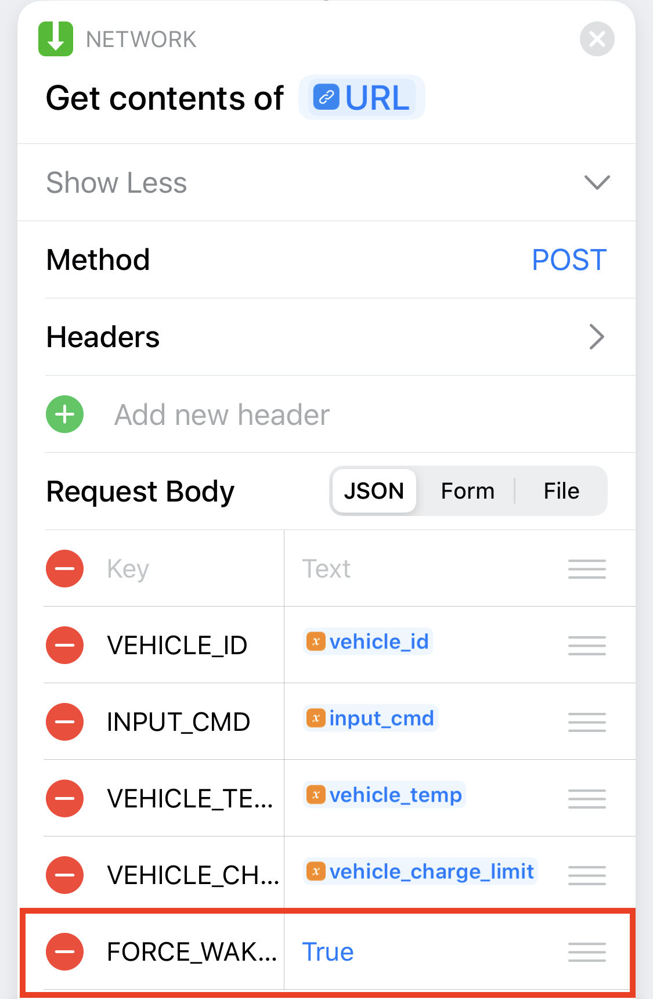

README
=========

### Introduction

After developing and using a [set of iOS shortcuts](https://github.com/dburkland/tesla_legacy_ios_shortcuts) for various Tesla-related functions I ran into a few issues:

  * Slow shortcut execution times, sometimes 1-2 minutes to open the frunk for example
  * Lack of advanced logic in iOS shortcuts that made dealing with certain vehicle states both slow & problematic

As a result, I have developed a new set of iOS shortcuts along with a cloud-based API service. These shortcuts are much simpler as the logic for dealing with things like vehicle state are now handled by the Cloud API service. Shortcuts now take only seconds to run regardless of what state the vehicle is in or how slow your mobile device's network connection is (as long as it is available). The Cloud API service is something I created myself in Python and host as a Google Compute Platform (GCP) Cloud Function.

### Setup

In order to import the shortcuts, you will first need to allow the import of untrusted shortcuts. This can be done by completing the steps documented [here](https://9to5mac.com/2019/08/14/allow-untrusted-shortcuts-ios-13/). When ready, you can then tap on the link next to "Download Latest Tesla Shortcuts" to download & install the shortcut downloader. With the shortcut downloader now installed, please execute it via the Shortcuts app to download each of the shortcuts in the list below. Once each shortcut has been imported into the Shortcuts app, you will then need to execute the "Generate Tesla Token" shortcut. This results in the creation of an authentication token that is used to communicate with your car. Once that is complete, you can then execute any of the other Tesla shortcuts as you wish.

### Tesla iOS Shortcut Inventory

* [Download Latest Tesla Shortcuts](https://www.icloud.com/shortcuts/159132835013422abc193e8a8124e625)
  * Allows you to download each of the published Tesla legacy shortcuts, right from the Shortcuts app.
  * NOTE: Anytime a new version of the Tesla legacy shortcuts is released 

* Generate Tesla Token
  * Generates an authorization token from the captured Tesla.com credentials
  * NOTE: This shortcut needs to be executed at least every 45 days since the tokens automatically expire
  * RECOMMENDATION: Set a reminder in your favorite calendaring or task app with the "workflow://run-workflow?name=Generate_Tesla_Token" link in the notes section

* Actuate Frunk
  * Wakes the vehicle (if needed) and actuates the frunk

* Actuate Trunk
  * Wakes the vehicle (if needed) and actuates the trunk

* Turn On HVAC Normal
  * Wakes the vehicle (if needed), turns on the HVAC system, and sets the temperature to 67 degrees Fahrenheit

* Turn On HVAC Max
  * Wakes the vehicle (if needed), turns on the HVAC system, sets the temperature to 82 degrees Fahrenheit, and turns on the driver's seat warmer

* Turn On HVAC Max Spouse
  * Wakes the vehicle (if needed), turns on the HVAC system, sets the temperature to 82 degrees Fahrenheit, and turns on both the driver's & front passenger's seat warmers

* Turn Off HVAC
  * Wakes the vehicle (if needed) and turns off the HVAC system

* Lock Doors
  * Wakes the vehicle (if needed) and locks the doors

* Unlock Doors
  * Wakes the vehicle (if needed) and unlocks the doors

* Turn On Sentry
  * Wakes the vehicle (if needed) and turns on Sentry Mode

* Turn Off Sentry
  * Wakes the vehicle (if needed) and turns off Sentry Mode

* Vent Windows
  * Wakes the vehicle (if needed) and vents the windows

* Close Windows
  * Wakes the vehicle (if needed) and closes the windows

* Set Charge Limit
  * Wakes the vehicle (if needed) and sets the charge limit to the user-selected percentage

* Open Charge Port Door
  * Wakes the vehicle (if needed) and opens the charge port door

* Close Charge Port Door
  * Wakes the vehicle (if needed) and closes the charge port door

* Start Charging
  * Wakes the vehicle (if needed) and starts charging

* Stop Charging
  * Wakes the vehicle (if needed) and stops charging

* Honk Horn
  * Wakes the vehicle (if needed) and honks the horn

* Flash Lights
  * Wakes the vehicle (if needed) and flashes the lights

* Start Remote Drive
  * Wakes the vevhicle (if needed) and starts a remote driving session
 
### FAQs

* What can you do if you receive error messages like the one below?
  * 
  * Delete the "Generate Tesla Token" shortcut and re-import it.
  * Execute the re-imported "Generate Tesla Token" shortcut, this time making sure to select "Allow" when prompted.
  * Re-run the Tesla shortcut that you originally tried to execute.
* How can I call these shortcuts using "Hey Siri"?
  * The name of the shortcut is automatically setup as the voice command phrase that Siri recognizes. 
  * If you would prefer another shortcut voice command phrase, you can simply rename the shortcut (after it is imported) in the Shortcuts app to whatever you like.
  * Once the shortcut is named appropriately, simply say "Hey Siri <Name of Shortcut>".
  * NOTE: Please keep in mind that the shortcut name must be unique from other shortcuts in your library. As an example, I tried to rename **Turn on HVAC Normal** to **Turn on Heat**, but that command is associated with HomeKit so it doesn't work. **Turn Heat On** however works perfectly fine.
* How secure are these shortcuts?
  * The authentication token that is generated by the "Generate Tesla Token" shortcut is stored in your personal iCloud Drive. The shortcut is only visible to apps or services that have access to your iCloud drive meaning folks cannot publicly access this data by default. 
  * When a shortcut is executed, the authentication token is sent to the Cloud API service using TLS where it is then used to communicate with Tesla. The authentication token is never logged or recorded in any way, shape or form.
  * NOTE: I do NOT log or record any usage data, nor do I log or record any of the generated Tesla API tokens.
  
  
## Hosting Relay API on Azure Functions
To ensure you are in full control of the communication between your iOS device and the Tesla API, you can host the 
required relay API yourself. This repo contains an example deployed on the [Azure Functions](https://azure.microsoft.com/en-us/services/functions/#features), which should result in no cost depending on your usage. In any event please consult the latest Azure pricing information.

### Setup Azure Function
To set it up follow the [get started guide](https://docs.microsoft.com/en-us/azure/azure-functions/functions-create-first-azure-function-azure-cli?tabs=bash%2Cbrowser&pivots=programming-language-python) 
and copy paste the code found [here](/azure-function/TeslaAPI) into the created function folder. 
Its encouraged to name the function _TeslaAPI_, otherwise you might have to adapt the _function.json_

### Modify Shortcut
Download and open the _Generate Tesla Token_ shortcut as described above. Scroll down and modify the value for 
the ``url`` variable, replacing it with the endpoint of your Azure function. Rerun the shortcut to ensure the correct url is put into your config file inside iCloud Drive.



### Force Wakeup
In case you want to force your Tesla to wakeup when executing a Shortcut, set a new _Boolean_ field to the 
*Get contents of URL* box, called ``FORCE_WAKEUP``:



### Optional Telegram integration
Optionally you can receive more details on errors via a Telegram Bot. Follow these steps to set it up:

1. Create a new Telegram Bot using the BotFather as explained here. Take note of the Http Token.
2. Obtain the chat id by writing any message to your new bot and visiting ``https://api.telegram.org/bot[HTTP-TOKEN]/getUpdates``
3. Create a file called ``telegram_config.json`` in the _TeslaAPI_ folder with the following content (replace with your actual values):

```
{
  "token": "<YOUR HTTP TOKEN>",
  "chatId": "<YOUR CHAT ID>"
}
```